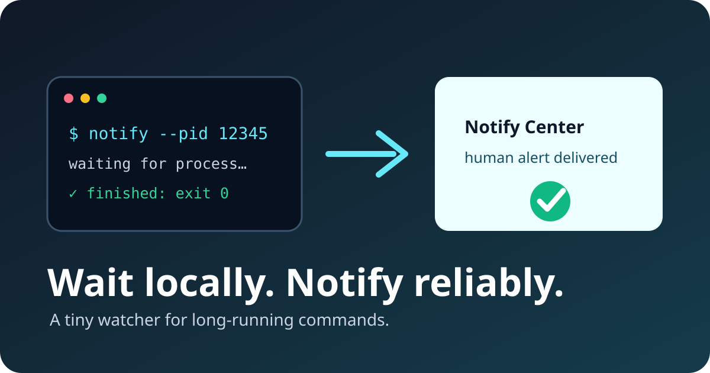

# Notificly

[Русский](docs/README.ru.md) · [中文](docs/README.zh-CN.md) · [Docs](docs/)



> A tiny process watcher that waits for local commands and sends a durable completion notification.

Notificly is for agents, CI jobs, migrations, and scripts that should finish in
the background without a polling loop. It watches a PID or command query,
optionally includes a bounded log tail, and reports completion, failure, or
timeout through Notify Center.

## Install

```bash
sudo install -m 0755 bin/notify bin/notify-producer /usr/local/bin/
```

## Start in minutes

1. Create `~/.config/secrets/notifier.env` with `NOTIFY_CENTER_EVENT_URL` and a project-scoped `NOTIFY_CENTER_TOKEN`.
2. Watch a process: `notify -n --pid 12345 --no-log --replace`.
3. For a command query: `notify -n --query 'my-command' --first --hard-timeout 30m`.

## Learn more

- [CLI reference](docs/cli.md)
- [Русская документация](docs/cli.ru.md)
- [中文文档](docs/cli.zh.md)
- [Notify Center](https://github.com/megamen32/notify)

## License

[MIT](LICENSE)
