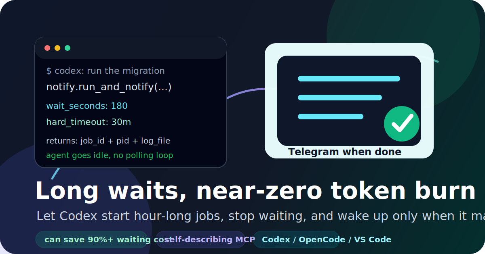

# Notify MCP

[English](README.md) | **Русский** | [中文](README.zh.md)

<p align="center">
  
</p>

**Хватит платить AI-агенту за то, что он смотрит в терминал.**

Notify MCP позволяет Codex и другим coding-агентам запускать долгие неинтерактивные задачи, ждать только короткое ограниченное время, а затем возвращать управление с `job_id`, `pid` и `log_file`. Процесс продолжает работать в фоне, `/usr/local/bin/notify` следит за ним, а Telegram сообщает, когда задача завершилась или достигла hard timeout.

Для часовых сборок, миграций, тестовых прогонов, бэкапов и деплоев это может сократить расход токенов на ожидание и polling на **90%+** по сравнению с агентом, который постоянно проверяет логи до завершения команды.

## Зачем это агентам

- **Codex long-wait mode:** запустить задачу, подождать до 180 секунд и перестать жечь токены.
- **Без polling loop:** MCP-схема инструмента прямо говорит модели вернуться, когда `alive=true`.
- **Telegram completion:** успех, ошибка, логи и hard-timeout приходят вне чата.
- **Self-describing MCP:** правила использования встроены в `tools/list`; skill не нужен для MCP-aware клиентов.
- **PTY-safe разделение:** Notify MCP — для неинтерактивных задач; `pty-mcp` — для prompts, TUI, редакторов и keystrokes.

## MCP-установка за 30 секунд

Для MCP-клиентов самый простой способ — `npx`:

```bash
npx -y github:megamen32/notify
```

Эта команда запускает stdio MCP server. В пакет уже встроен Bash watcher, а launcher автоматически выставляет `NOTIFY_BIN`, поэтому MCP server работает без ручного clone.

Для Telegram-уведомлений создайте secrets для пользователя, под которым запускается MCP-клиент:

```bash
mkdir -p ~/.config/secrets
cat > ~/.config/secrets/notifier.env <<'ENV'
TELEGRAM_BOT_TOKEN=123456:telegram-bot-token
TELEGRAM_CHAT_ID=123456789
ENV
chmod 600 ~/.config/secrets/notifier.env
```

Нужна ещё и raw CLI?

```bash
npm exec -y --package github:megamen32/notify -- notify-install
# или скачайте notify-mcp-v*.tar.gz из Releases
```

## Добавить в Codex

```bash
codex mcp add notify -- npx -y github:megamen32/notify
codex mcp list
```

Или отредактируйте `~/.codex/config.toml` / `.codex/config.toml`:

```toml
[mcp_servers.notify]
command = "npx"
args = ["-y", "github:megamen32/notify"]
```

## Добавить в OpenCode

Добавьте это в `~/.config/opencode/opencode.jsonc` или проектный `opencode.jsonc`:

```jsonc
{
  "mcp": {
    "notify": {
      "type": "local",
      "command": ["npx", "-y", "github:megamen32/notify"],
      "enabled": true
    }
  }
}
```

## Добавить в VS Code

Создайте `.vscode/mcp.json` в workspace или используйте **MCP: Open User Configuration**:

```json
{
  "servers": {
    "notify": {
      "type": "stdio",
      "command": "npx",
      "args": ["-y", "github:megamen32/notify"]
    }
  }
}
```

Затем запустите **MCP: List Servers** и стартуйте `notify`.

## Что видит агент

MCP server сам обучает модель правилу:

```text
Для неинтерактивных задач, которые ожидаемо идут дольше 3 минут,
используй run_and_notify с log_mode="tail", wait_seconds <= 180,
hard_timeout="30m", replace=true.

Если alive=true/state="running", прекрати ждать и сообщи job_id,
pid и log_file. Не продолжай polling без явной просьбы.
Для interactive/TUI/prompt команд используй pty-mcp.
```

## Скачиваемые release assets

Каждый GitHub release включает:

- `notify-mcp-vX.Y.Z.tar.gz` — portable bundle с `install.sh`
- `notify-mcp-vX.Y.Z.zip` — тот же bundle в zip
- `notify-mcp-X.Y.Z.tgz` — npm package tarball
- `SHA256SUMS` — checksums

## Документация

- [MCP server](docs/mcp.ru.md) — tools, schemas, поведение агента, client configs.
- [CLI tool](docs/cli.ru.md) — использование `/usr/local/bin/notify`, Telegram secrets, logs.
- [AI skill](docs/skill.ru.md) — optional fallback для клиентов, которые плохо показывают MCP tool descriptions.

## Skill всё ещё нужен?

Обычно **нет**. Для Codex, OpenCode, VS Code, Claude и других MCP-aware клиентов важные инструкции уже встроены прямо в descriptions MCP tools. Оставляйте skill только как fallback для runtimes, которые ненадёжно показывают MCP schema descriptions.

## License

MIT
